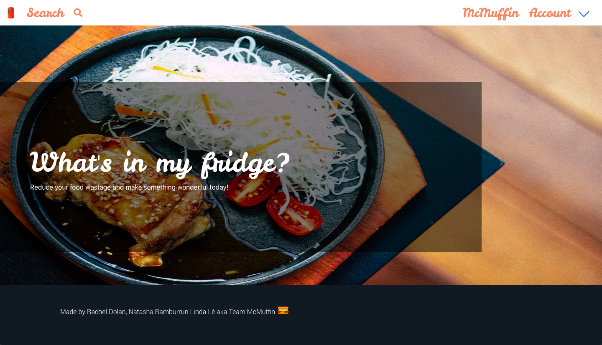

# GA WDI-34  Project #3: A MEAN stack Application
## 'What's in your fridge?'

[Heroku Link](https://what-is-in-my-fridge.herokuapp.com/#!/)

An application that aims to reduce food wastage by allowing the user to enter the ingredients they currently have in their fridge and the app, using a third-party API, will present the user recipes based on their input which can then be filtered by dietary requirements and sorted by the number of likes. Built by Linda Le, Rachel Dolan and Natasha Ramburrun.

 #### Technologies Used
* AngularJS
* Node.js
* CSS3
* Sass & Bulma
* HTML5

 #### Planning
 The project was planned using a whiteboard and the project management tool, Trello. We also worked as a team to complete a wireframe which highlighted the user experience.  

 #### Back-End

Setting out, our main aim for MVP was to be able to send requests to the Spoonacular API and be able to display the data. Around this we built a fully REStful app giving the user the ability to register, login, update their profile, create and delete comments/ratings and favourite and unfavourite recipes.

 #### Blockers

As this was our first instance using external APIs having the API be so central to the app made the build process a little more complex. Spoonacular proved harder to implement than we first thought as the process was not as straightforward given that the documentation was split across two different websites, Mashape and RapidAPI. Additionally, once we had figured out how to make a request to the API, the data that was returned was not always correct. i.e. if you searched beef as a main ingredient, a recipe for s'mores would display. I flagged this issue with Spoonacular in hope of getting it fixed.

#### Wins

 #### App development

We were able to make full use of the Spoonacular API and given that it was our main blocker for the project we were still able to implement, autocomplete on ingredients entered and have a complex search that allowed the user to search not only by ingredient but by diet.

#### More Time

With more time, I would certainly add the ability to post your own images of recipes you have tried to develop more of a community factor. To add to this, I also wanted to include an inspiration page which would display a random selection of the most highly rated recipes.
